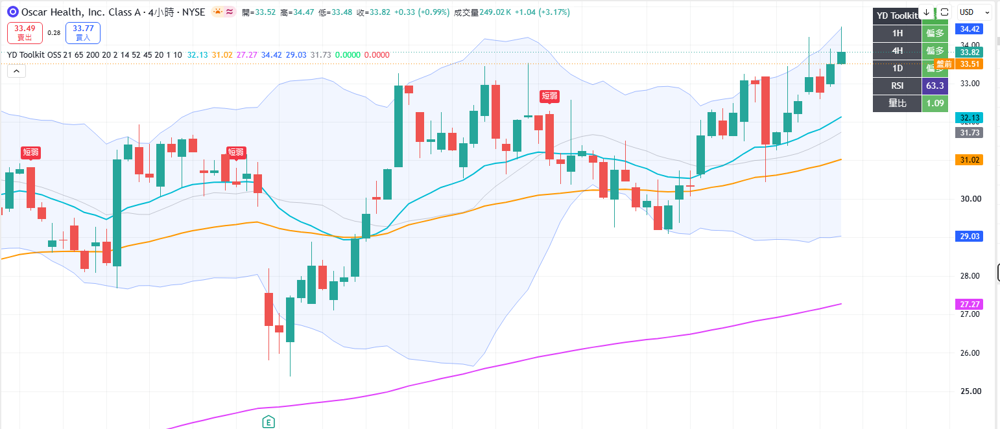

# YD Market Toolkit

[繁體中文](#繁體中文) · [English](#english)

## 繁體中文

YD Market Toolkit 是一套開源的 TradingView 市場趨勢觀察工具，將 EMA、布林通道、RSI、成交量與多週期方向整合在同一張圖表中，協助使用者快速辨識市場狀態。

> 本專案只提供技術分析與程式設計範例，不構成投資建議、獲利保證或交易招攬。

### 功能

- EMA 21／65／200 趨勢結構
- Bollinger Bands 20／2
- RSI 14 動能狀態
- 成交量相對 20 期均量
- 1 小時／4 小時／日線多週期方向
- 「觀察、轉強、偏多、短線弱」狀態面板
- 訊號冷卻，減少盤整區重複提醒
- 可建立 TradingView Alert
- 所有參數均可調整

### 安裝

1. 開啟 TradingView 的 Pine Editor。
2. 複製 [`src/YD_Market_Toolkit.pine`](src/YD_Market_Toolkit.pine) 全部內容。
3. 建立新指標、貼上程式碼並儲存。
4. 按「加到圖表」。
5. 如需通知，在 TradingView 建立 Alert，選擇本指標的「YD 轉強」或「YD 短線轉弱」。

### 狀態定義

| 狀態 | 公開版判斷概念 |
| --- | --- |
| 轉強 | EMA21 向上穿越 EMA65，收盤在 EMA200 上方，RSI 與量能符合門檻 |
| 偏多 | EMA21 > EMA65 > EMA200，且收盤在 EMA21 上方 |
| 短線弱 | 收盤跌破 EMA21，或 RSI 低於弱勢門檻 |
| 觀察 | 尚未符合以上條件 |

完整條件可直接查看原始碼；這正是本專案作為開源教學工具的目的。

### 多週期資料與 repaint 說明

- 1H、4H 與日線狀態由 TradingView 的多週期資料取得。
- 尚未收盤的高週期 K 棒，其數值可能隨盤中價格變動；這是即時資料更新，不代表歷史訊號被竄改。
- 判讀或驗證訊號時，建議以 K 棒收盤後的狀態為準。
- 本公開版不使用未來資料或 lookahead 技巧提前取得尚未完成的高週期結果。

### 可重現檢查清單

1. 將指標加入任一具有 1H、4H 與日線資料的商品圖表。
2. 確認 EMA、Bollinger Bands、RSI、量能與多週期面板正常顯示。
3. 切換時間週期後，確認面板沒有編譯或執行錯誤。
4. 在 K 棒收盤前後比較高週期狀態，記錄即時變動與收盤確認結果。
5. 建立「YD 轉強」及「YD 短線轉弱」Alert，確認條件可供選擇。

若發現可重現問題，請附上商品、交易所、圖表週期、時區、發生時間與畫面截圖建立 Issue。

### 專案界線

此 repo 不包含：

- 私人或客戶資料、IP、帳號、密碼、API Key
- 會員、訂閱或授權系統
- 私有杯柄辨識與商業版策略
- 自動下單、券商連線或獲利承諾

詳見 [`docs/PUBLIC_PRIVATE_BOUNDARY.md`](docs/PUBLIC_PRIVATE_BOUNDARY.md)。

### 參與方式

歡迎回報問題、提出功能建議或送出 Pull Request。開始前請閱讀 [`CONTRIBUTING.md`](CONTRIBUTING.md)。資安問題請依 [`SECURITY.md`](SECURITY.md) 私下回報，不要公開敏感資訊。

### 路線圖

- [x] v1.0：EMA／BOLL／RSI／量能／多週期面板
- [ ] 加入更多語言的介面文字
- [ ] 增加可重現的圖表示例與測試案例
- [ ] 撰寫 Pine Script 設計說明
- [ ] 蒐集社群回饋並改善無障礙配色

### 授權

程式碼與文件採 [MIT License](LICENSE) 授權。

---

## English

YD Market Toolkit is an open-source TradingView indicator that combines EMA structure, Bollinger Bands, RSI, relative volume, and multi-timeframe direction in one chart.

### Highlights

- EMA 21/65/200 market structure
- Bollinger Bands (20, 2)
- RSI momentum and relative-volume filters
- 1H, 4H, and 1D direction dashboard
- Strengthening, bullish, weakening, and watch states
- Cooldown logic to reduce repeated alerts
- Configurable TradingView alerts and inputs

### Install

Copy [`src/YD_Market_Toolkit.pine`](src/YD_Market_Toolkit.pine) into TradingView Pine Editor, save it, and add it to a chart.

### Multi-timeframe and repainting notes

- The 1H, 4H, and 1D states use TradingView multi-timeframe data.
- Values from an unclosed higher-timeframe bar can change intrabar as live prices update.
- For reproducible validation, evaluate signals after the relevant bars close.
- The public script does not intentionally use future data or lookahead behavior to obtain unfinished higher-timeframe results early.

### Reproducible verification checklist

1. Add the indicator to a symbol with 1H, 4H, and daily history.
2. Confirm that the EMA, Bollinger Bands, RSI, volume, and dashboard render without errors.
3. Change chart timeframes and confirm that the script continues to run.
4. Compare higher-timeframe states before and after bar close and record the confirmed result.
5. Confirm that the “YD Strengthening” and “YD Short-term Weakening” alert conditions are available.

When reporting a reproducible issue, include the symbol, exchange, chart timeframe, timezone, occurrence time, and a screenshot.

This software is provided for education and technical-analysis research only. It is not financial advice and does not guarantee results.

See [`CONTRIBUTING.md`](CONTRIBUTING.md) to contribute. Licensed under the [MIT License](LICENSE).

